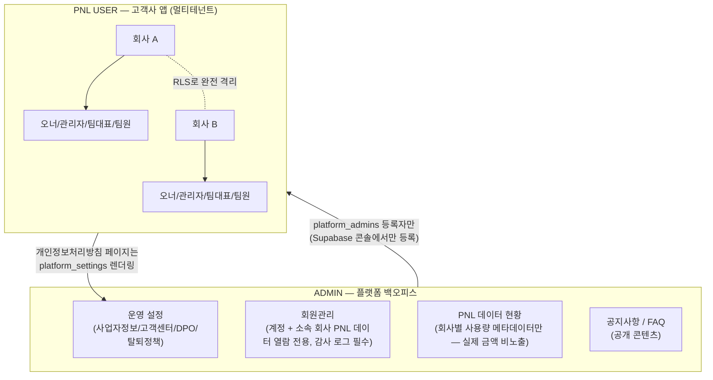

# 전체 구조 개요

최종 수정: 2026-08-17 · 상세는 `PRD.md`(요구사항) / `SERVICE_SPEC.md`(화면·플로우) / `BACKEND_DESIGN.md`(API) / `supabase/migrations/0001_init_schema.sql`(스키마) 참고. 이 문서는 그 전체를 한 장으로 요약한 지도 역할.

## 두 축 구조

## PNL USER — 고객사 앱

**목적**: 회사가 가입해서 자기 회사의 프로젝트별 손익을 관리. 회사간 데이터는 절대 섞이지 않는다(RLS 핵심 원칙).

| 영역 | 테이블 | 요약 |
|---|---|---|
| 조직/인증 | `companies`, `profiles`, `memberships`, `invitations`, `teams` | 회사 = 테넌트. 이메일 1개는 활성 회사 1개만(PRD 2절) |
| 권한 | `role_permissions` | 오너(고정 전권)/관리자/팀대표/팀원 4단계, role 단위 커스텀 오버라이드 가능 |
| 핵심 데이터 | `projects`, `transactions`, `upload_batches` | 온라인 입력 + 엑셀 업로드(중복 의심 프리뷰) 둘 다 이 테이블로 합산 |
| 거버넌스 | `deletion_requests` | 팀원은 직접 삭제 불가 — 승인 워크플로우 경유만 (RLS가 DB 레벨에서 강제) |

**격리 방식**: 모든 테이블 RLS가 `company_id = my_company_id()` 강제. `projects`/`transactions`는 여기에 더해 `has_permission()` 함수로 role 기반 CRUD 하한선까지 DB가 직접 검사 (SECURITY_REVIEW.md 치명적2 수정 결과).

## ADMIN — 플랫폼 백오피스

**목적**: 서비스 운영자가 전체 플랫폼을 운영. **PNL USER의 회사 데이터와는 원칙적으로 분리**되어 있고, 아래 4가지 기능만 예외적으로 경계를 넘는다 — 그마저도 각각 다른 강도로 통제된다.

| 기능 | 접근 방식 | 통제 수준 |
|---|---|---|
| 운영 설정 (사업자정보/고객센터/DPO/탈퇴정책) | `platform_settings` 테이블 직접 RLS | 쓰기: 운영자만 / 읽기: 완전 공개(비로그인 포함, 처리방침 페이지용) |
| **회원관리** (계정 + 소속 회사 PNL 데이터 **열람 전용**, 수정·삭제 불가) | `admin_get_company_members/projects/transactions` RPC | **감사 로그 필수** — `platform_admin_access_log`에 누가/언제/어느 회사를/무엇을 열람했는지 전부 기록. RLS로 조용히 열어주지 않고 반드시 이 RPC 경유만 허용 |
| PNL 데이터 현황 | `admin_list_companies` RPC | 집계 메타데이터만(회사별 멤버 수/프로젝트 수/거래 건수) — 실제 금액·항목명은 여기서 안 보임 |
| 공지사항 / FAQ | `notices`, `faqs` 테이블 직접 RLS | 일반 공개 콘텐츠, 테넌트 데이터 아님 — 쓰기만 운영자 제한. **공지사항은 PNL USER 로그인 후 대시보드에도 노출** |

**운영자 등록 자체(`platform_admins`)는 앱 어디에도 없다** — Supabase 콘솔에서 수동 등록만 가능. 자기 자신을 운영자로 임명하는 셀프서비스 경로를 원천 차단하기 위한 의도적 설계.

**운영자 등급**: `super_admin`(최고 관리자)과 `operator`(일반 운영자)로 나뉜다. 감사 로그(`platform_admin_access_log`) 열람은 super_admin이거나 개별로 `can_view_audit_log` 권한을 부여받은 operator만 가능 — 일반 운영자는 기본적으로 다른 운영자의 열람 이력을 볼 수 없다. 등급/권한 부여도 Supabase 콘솔 전용(일관된 신뢰 경계).

## 왜 "회원관리"만 감사 로그가 필요한가

- 운영 설정: 회사 데이터 아님 (플랫폼 전역 설정) — 로그 불필요
- PNL 데이터 현황: 집계 숫자만, 개별 회사의 실제 내용(금액/항목명) 비노출 — 민감도 낮음
- **회원관리**: 운영자가 특정 회사의 실제 프로젝트/거래내역(금액, 항목명 등)까지 열람 가능 — 지금까지 "회사간 데이터 절대 격리"로 지켜온 원칙의 실질적 예외. 그래서 RLS로 조용히 허용하지 않고, 반드시 로그가 남는 RPC로만 열람하게 설계했다. 누가 언제 어느 회사 데이터를 봤는지 항상 추적 가능해야 한다.

## 2026-08-17 확정 (이전 "아직 못 정한 것" 해소)

- 회원관리는 **열람 전용** — 수정/삭제 기능 없음. 고객 데이터 수정 요청은 1차 범위 밖(별도 프로세스).
- 감사 로그는 **super_admin + `can_view_audit_log` 부여받은 operator만** 열람. 일반 운영자는 기본적으로 접근 불가.
- 공지사항은 **PNL USER 로그인 후 대시보드에도 노출**된다 (SERVICE_SPEC 6절 반영).

## 문서 지도
- `PRD.md` — 요구사항/의사결정 히스토리
- `SERVICE_SPEC.md` — PNL USER + ADMIN 화면·플로우 (7절)
- `BACKEND_DESIGN.md` — API 계약, RLS 전략
- `SECURITY_REVIEW.md` — 보안 점검 이력
- `PRIVACY_POLICY_DRAFT.md` — 개인정보처리방침 초안
- `supabase/migrations/0001_init_schema.sql` — 실제 스키마
