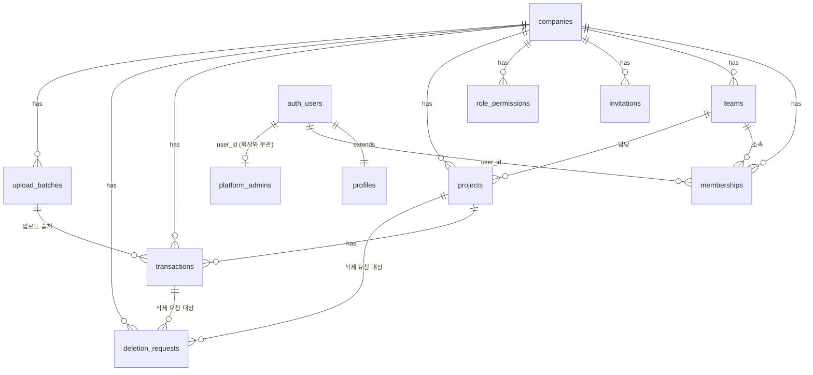

# 백엔드 설계 — Supabase 스키마 / RLS / API 계약

작성: backend-developer · 입력: `PRD.md`, `SERVICE_SPEC.md`, `SECURITY_REVIEW.md` · 최종 수정: 2026-08-17
SQL 원본: `supabase/migrations/0001_init_schema.sql`

> **2026-08-17 개정1**: privacy-security-officer 리뷰(`SECURITY_REVIEW.md`)에서 발견된 치명적 2건을 반영해 2절(RLS 전략)이 바뀌었다. 이전 버전은 "role_permissions 기반 세부 권한은 API 레이어에서만 판단"이라고 적었는데, 이는 PRD 7절의 API-first(Supabase 클라이언트 직접 통신) 방향과 충돌해 팀원이 브라우저에서 직접 테이블에 접근하면 삭제 승인 워크플로우를 우회할 수 있는 구조였다. 지금은 DB(RLS + 헬퍼 함수)가 직접 강제한다.
>
> **2026-08-17 개정2**: PRD 5.5절 반영 — ADMIN 백오피스에 회원관리(회사 실데이터 열람)/PNL 데이터 현황/공지사항/FAQ 추가. 전체 구조는 `ARCHITECTURE.md` 참고.

## 1. ERD 요약



`platform_admins`/`platform_settings`는 `companies`와 연결되지 않는 **플랫폼 전역 테이블**이다 — 위 ERD의 나머지 테넌트 테이블들과 성격이 다르므로 별도 표기.

## 2. RLS 전략 (개정 — DB가 직접 강제)

- **RLS = 테넌트 격리 + role 기반 CRUD 하한선의 최종 방어선.** 모든 테이블은 `company_id = my_company_id()`를 강제하고, `projects`/`transactions`는 insert/update/delete마다 `has_permission(perm_key, team_id)` 헬퍼 함수로 role_permissions 커스텀 매트릭스(없으면 `default_permissions()` 폴백)를 실시간 조회해 반영한다. **팀원(member)은 delete 정책 자체가 없어 어떤 경로로 접근해도(Server Action이든 브라우저의 Supabase 클라이언트든) 직접 삭제가 불가능** — `request_deletion` → `decide_deletion_request` RPC 경유만 가능.
- `has_permission()`은 `security definer` SQL 함수라 RLS 정책 안에서 호출해도 무한 재귀나 권한 우회 없이 동작한다. team_lead/member는 대상의 `team_id`가 본인 소속 팀과 같을 때만 통과(팀 범위 스코핑).
- **API 레이어(Next.js Server Action)의 역할은 이제 "1차 방어"가 아니라 UX 보조**: 저장 전 미리 에러 메시지를 보여주거나, 프리뷰 화면(엑셀 업로드) 같은 다단계 흐름을 조립하는 역할. 최종 허용/거부는 항상 DB가 판단하므로, Server Action을 건너뛰고 클라이언트가 직접 Supabase를 호출해도 동일한 규칙이 적용된다 (PRD 7절 API-first 전제와 정합).
- `invitations`도 동일 원칙 적용: `role_rank()` 함수로 "본인보다 낮은 role만 초대 가능"을 WITH CHECK에서 직접 검증한다 (이전엔 서버 검증이 전혀 없었음 — 리뷰 중 추가 발견해 같이 수정).

## 3. 권한 매트릭스 기본값 (가정 — product-manager/service-planner 확인 필요)

PRD 5.1은 큰 틀(오너/관리자=전체, 팀대표=팀 범위, 팀원=조회+입력+삭제요청)만 정의했고, 세부 항목(수정 가능 여부 등)은 명시되지 않아 아래처럼 가정하고 SQL `default_permissions()` 함수의 하드코딩 기본값(회사가 `role_permissions`에 커스텀 row를 만들지 않았을 때 DB가 직접 적용하는 폴백)으로 구현했다.

| 권한 항목 | 관리자 | 팀 대표 | 팀원 |
|---|---|---|---|
| project_create/update/delete | 전체 허용 | 자기 팀만 허용 | 불가 |
| transaction_create/update | 전체 허용 | 자기 팀만 허용 | **자기 팀만 허용 (가정)** |
| transaction_delete | 즉시 허용 | 즉시 허용(자기 팀) | **불가 — deletion_requests 경유만 가능** |
| excel_upload | 허용 | 허용(자기 팀 범위) | **허용 (가정 — "입력"에 포함된다고 해석)** |
| invite_member | 팀대표/팀원 초대 | 팀원 초대 | 불가 |
| company_settings | 일부 (범위 미정 — 우선 시스템 설정 전체 제외, 팀/멤버 관리만 허용으로 구현) | 불가 | 불가 |

**⚠️ 확인 필요**: 팀원의 거래내역 "수정" 권한, 팀원의 엑셀 업로드 권한, 관리자의 "회사 설정 일부"의 정확한 범위. 다르면 `role_permissions` 기본값과 Server Action 체크 로직만 수정하면 되므로 스키마 변경은 불필요.

## 4. 주요 테이블

| 테이블 | 핵심 제약 |
|---|---|
| `memberships` | `user_id`당 `status='active'` 1건만 (부분 유니크 인덱스) → PRD 2절의 "이메일 1개 = 회사 1개" 강제 |
| `memberships` | `company_id`당 `is_representative=true & active` 1건만 → PRD 5.2 "대표계정 회사당 1명" 강제 |
| `deletion_requests` | 동일 project/transaction에 `pending` 요청 1건만 (중복 요청 방지) |
| `transactions` | `(company_id, project_id, tx_date, category, amount, item_name)` 인덱스 → 엑셀 업로드 중복 의심 판정 쿼리용 |
| `role_permissions` | `permissions`는 jsonb(EAV 대신 단일 컬럼) — `has_permission()` 함수가 키로 조회. `role` check 제약이 `'owner'`를 원천 배제해 오너 오버라이드 자체가 생성 불가 |
| `deletion_requests` | `decide_deletion_request` RPC + RLS 양쪽에서 `requested_by <> auth.uid()` 검증 → 본인 요청 본인 승인 방지 (이중 방어) |
| `memberships` | `memberships_update` 정책의 `WITH CHECK`가 `role<>'owner'`, `is_representative=false`, `user_id<>auth.uid()`를 강제 → 권한 자기 격상/대표계정 탈취/본인 row 수정 모두 차단. `prevent_last_owner_removal` 트리거가 회사의 마지막 오너 제거를 추가로 차단 |
| `platform_admins` | `role`(`super_admin`/`operator`) + `can_view_audit_log` 컬럼. insert/update/delete 정책 없음(의도적) → 앱에서 운영자 추가·해제·등급변경 불가, Supabase 콘솔에서만 |
| `platform_settings` | `id boolean primary key default true check(id)` 싱글턴 패턴 → 행 1개만 존재 가능. select는 완전 공개(비로그인 포함), update는 `is_platform_admin()`만 |
| `platform_admin_access_log` | insert 정책 없음(의도적) → `admin_get_company_*` RPC 내부에서만 기록 생성, 앱에서 로그 조작 불가. select는 `can_view_audit_log()`(super_admin 또는 권한 부여받은 operator)만 |
| `notices`, `faqs` | 테넌트 데이터 아님. `is_published=true`면 완전 공개, 아니면 `is_platform_admin()`만 조회(임시저장/예약 발행용) |

## 5. RPC 함수 (트랜잭션 무결성이 필요한 동작은 SQL 함수로 캡슐화)

| 함수 | 역할 | 호출 시점 |
|---|---|---|
| `create_company_with_owner(name)` | 회사 생성 + 호출자를 오너/대표계정으로 등록 | 회원가입(신규 회사) 완료 후 |
| `get_invitation_preview(token)` | **비로그인 접근 가능** — 초대장 최소 정보(이메일/회사명/role/상태) 미리보기 | 초대 수락 화면 진입 시 (프론트엔드 구현 중 발견: 일반 RLS로는 초대 당사자가 자기 초대장도 못 읽는 문제 해결) |
| `accept_invitation(token)` | 초대 토큰 검증 + 멤버십 생성 | 초대 수락 화면 |
| `request_deletion(project_id, transaction_id, reason)` | 삭제 요청 생성 (팀원 전용 경로) | 삭제 요청 모달 제출 |
| `decide_deletion_request(request_id, approve, reason)` | 승인 시 실제 삭제 실행 / 반려 시 상태만 변경 | 삭제 승인함 |
| `admin_get_company_members(company_id)` | 회사 멤버십+계정 정보 열람 + **감사 로그 기록** | ADMIN 회원관리 상세 화면 |
| `admin_get_company_projects(company_id)` / `admin_get_company_transactions(company_id)` | 회사 실데이터 열람 + **감사 로그 기록** | ADMIN 회원관리 상세 화면 (PNL 데이터 탭) |
| `admin_list_companies()` | 회사별 집계 메타데이터(멤버/프로젝트/거래 건수) — 로그 없음 | ADMIN "PNL 데이터 현황" 목록 |

모두 `security definer` + 함수 내부에서 `auth.uid()` 기준으로 권한 검증한다. 삭제 관련 RPC(`request_deletion`/`decide_deletion_request`)는 이제 API 레이어의 "엔드포인트 미제공"이 아니라 **RLS의 `transactions_delete`/`projects_delete` 정책 자체가 member role에 매칭되지 않아 DB 레벨에서 직접 삭제가 원천 차단**되므로, 클라이언트가 어떤 경로로 접근하든 이 RPC 경유가 유일한 삭제 방법이다.

## 6. API 계약 초안 (frontend-developer 연동 기준)

Next.js Server Action 기준. 모두 Supabase 세션 쿠키로 인증, 응답은 `{ data, error }` 형태.

| 액션 | 입력 | 성공 응답 | 에러 케이스 |
|---|---|---|---|
| `signUpWithCompany` | email, password, companyName | `{ companyId }` | `EMAIL_TAKEN`, `ALREADY_MEMBER`(이미 활성 멤버십 존재) |
| `inviteMember` | email, role, teamId? | `{ invitationId }` | `FORBIDDEN`(권한 없음/본인보다 높은 role 시도), `ALREADY_MEMBER` |
| `acceptInvitation` | token | `{ companyId }` | `INVITE_EXPIRED`, `ALREADY_MEMBER` |
| `createProject` / `updateProject` | 프로젝트 필드 | `{ projectId }` | `FORBIDDEN`(role_permissions 미충족) |
| `createTransaction` / `updateTransaction` | 거래 필드 | `{ transactionId }` | `FORBIDDEN`, `VALIDATION_ERROR`(금액 0 이하 등) |
| `deleteProject` / `deleteTransaction` | id | `{ ok: true }` (즉시 삭제) 또는 `{ requiresApproval: true, requestId }`(팀원인 경우 `request_deletion` 호출로 전환) | `FORBIDDEN` |
| `decideDeletionRequest` | requestId, approve, reason | `{ ok: true }` | `FORBIDDEN`(승인 권한 없음), `NOT_FOUND`(이미 처리됨) |
| `previewExcelUpload` | 파싱된 행 배열(JSON) | `{ rows: [{ ...row, isDuplicateSuspect: bool }], newProjects: [...] }` | `MISSING_SHEET`, `EMPTY_FILE` |
| `commitExcelUpload` | 선택된 행 배열 + batchMeta | `{ batchId, saved, excluded, errors: [{row, reason}] }` | `FORBIDDEN`(excel_upload 권한 없음) |
| `updateRolePermissions` | role, permissions | `{ ok: true }` | `FORBIDDEN`(오너/관리자 아님), `CANNOT_OVERRIDE_OWNER` |
| `getDashboardData` | year?, status?, search? | KPI/차트/테이블용 집계 데이터 | — |
| `getPlatformSettings` | — | `platform_settings` 전체 (공개, 비로그인 호출 가능) | — |
| `updatePlatformSettings` | 사업자정보/고객센터/DPO/탈퇴정책 필드 | `{ ok: true }` | `FORBIDDEN`(`platform_admins` 미등록) |
| `adminListCompanies` | — | 회사별 집계 메타데이터 목록 | `FORBIDDEN` |
| `adminGetCompanyDetail` | companyId | 멤버 목록 + 프로젝트/거래내역 (내부적으로 3개 RPC 호출, 각각 감사 로그 기록) | `FORBIDDEN` |
| `listNotices` / `listFaqs` | — (공개) | 게시된 목록 | — |
| `upsertNotice` / `upsertFaq` | 콘텐츠 필드 | `{ ok: true }` | `FORBIDDEN` |

## 7. 엑셀 업로드 — 중복 의심 판정 쿼리 (SERVICE_SPEC 4절 구현)

`previewExcelUpload`에서 파싱된 각 행에 대해 다음 쿼리로 매칭 여부 확인:

```sql
select exists (
  select 1 from transactions
  where company_id = :company_id
    and project_id = :project_id
    and tx_date = :tx_date
    and category = :category
    and amount = :amount
    and item_name = :item_name
) as is_duplicate_suspect;
```

`transactions_dup_check_idx` 인덱스로 대량 행 업로드 시에도 성능 확보. 배치 처리는 행 단위 루프보다 임시 테이블(unnest) 기반 batch join으로 구현 권장 (구현 시 최적화).

## 8. 보안 체크리스트 — 1차 리뷰 반영 결과

`SECURITY_REVIEW.md` 항목별 처리 현황:

| 항목 | 상태 | 처리 내용 |
|---|---|---|
| 🔴 치명적1 — memberships 자기 격상 | ✅ 수정 | `memberships_update` 정책에 `WITH CHECK(role<>'owner', is_representative=false, user_id<>auth.uid())` 추가 |
| 🔴 치명적2 — projects/transactions role 미반영 | ✅ 수정 | insert/update/delete 정책 분리 + `has_permission()` 함수로 role_permissions 실시간 반영, member delete 정책 자체 제거 |
| 🟡 주요3 — 삭제 요청 자기승인 | ✅ 수정 | RLS(`requested_by <> auth.uid()`) + RPC 내부 체크 이중 반영 |
| 🟡 주요4 — SheetJS 버전/업로드 제한 | ⏳ 구현 단계 처리 | DB 제약이 아닌 Server Action 레벨 정책 — frontend/backend 구현 시 버전 고정 + 크기·행수 상한 적용 (5절 주석 참고) |
| 🟡 주요5 — 자유입력 필드 PII 혼입 | ⏳ 문서화 처리 | 개인정보처리방침 초안에 고지 문구 반영 예정 |
| 🟡 주요6 — 국외이전 | ✅ 해결 | Supabase 리전 `ap-northeast-2`(서울) 확정 — 데이터 국내 저장, 국외이전 미해당 |
| 🟢 권고7 — 최소 1 오너 유지 | ✅ 수정 | `prevent_last_owner_removal` 트리거 추가 |
| 🟢 권고8 — 개인정보처리방침 | ⏳ 별도 문서 | 스키마 확정 후 초안 작성 예정 |
| (추가 발견) 초대 시 role 상향 미검증 | ✅ 수정 | `invitations_manage` WITH CHECK에 `role_rank(role) < role_rank(my_role())` 추가, 초대 목록 조회도 관리 권한자만으로 제한 |

남은 항목(주요4/5, 권고8)은 구현 단계 또는 최종 법무 확정이 필요해 스키마만으로는 닫을 수 없음 — 아래 다음 단계에 배정. 주요6(국외이전)은 Supabase 리전을 `ap-northeast-2`로 확정하며 해결됨.

## 9. 다음 단계
1. privacy-security-officer — 위 표의 ✅ 항목 재검토(수정이 의도대로 됐는지 확인)
2. frontend-developer — 6절 API 계약 기준으로 화면 연동 (반응형, PRD 7절 API-first 원칙 준수)
3. product-manager — 3절 권한 매트릭스 가정 확인
4. 런칭 전 — 개인정보처리방침 정식 작성 (권고8)
5. 런칭 전 — 개인정보처리방침 정식 작성 (권고8)
