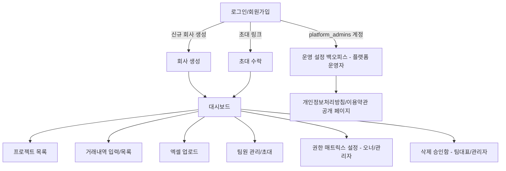

# 서비스 상세 스펙 — 화면 정의서 & 플로우

작성: service-planner · 입력: `PRD.md` · 최종 수정: 2026-08-17
범위: PRD 3절 1차(MVP) 기능 전체

**공통 원칙 (PRD 7절)**: 아래 모든 화면은 반응형(데스크톱+모바일 브라우저)으로 설계한다. 목록/테이블 화면은 좁은 화면에서 카드형으로 전환하는 레이아웃을 기본으로 한다 (ui-ux-designer 단계에서 breakpoint 확정).

## 0. 전체 화면 맵

## 1. 로그인 / 회원가입 / 회사 생성

### 1.1 플로우
1. 방문 → 로그인 화면
2. "회원가입" 선택 → 두 경로로 분기
   - **(a) 신규 회사 생성**: 이메일/비밀번호 입력 → 이메일 인증 → 회사명 입력 → 계정 생성 완료 → 해당 사용자는 자동으로 **오너 + 대표계정**
   - **(b) 초대 수락**: 초대 이메일의 링크 클릭 → 이미 가입된 이메일이면 로그인 후 바로 연결, 미가입이면 회원가입 폼(비밀번호만 설정) → 가입 완료 시 초대장에 지정된 **role**로 해당 회사 memberships 생성
3. 로그인 → 이메일/비밀번호 → 세션 발급 → 대시보드로 이동

**확정 (PRD 2절/5.4절)**: 이메일 1개 = 회사 1개만 (활성 멤버십 유일 제약). 회사 선택 화면 불필요.

**재가입 경로 (이직 또는 창업 둘 다 해당)**: 기존 회사 소속 상태에서는 (a) 신규 회사 생성도, (b) 다른 회사 초대 수락도 둘 다 차단된다 (아래 표). 사용자가 고객센터에 소속 해제를 요청 → **플랫폼 운영자가 Supabase 콘솔에서 기존 멤버십만 비활성화**(PRD 5.4절, 1차는 앱 내 UI 없음) → 해제 완료 안내 이메일 수신 → 이후 사용자는 **1.1절의 (a) 신규 회사 생성 또는 (b) 초대 수락 중 원하는 쪽을 스스로 진행** (창업이면 (a), 이직이면 (b) — 운영자가 대신 만들어주지 않음).

### 1.2 화면 정의서

| 화면 | 구성요소 | 동작 | 예외처리 |
|---|---|---|---|
| 로그인 | 이메일, 비밀번호, 로그인 버튼, 회원가입 링크 | 로그인 성공 시 대시보드 이동 | 잘못된 자격증명 → 에러 메시지(계정/비밀번호 불일치, 시도 횟수 노출 안 함), 미인증 이메일 → 인증 안내, 소속 회사 없음(해제 직후·재가입 전 등) → "신규 회사 생성 또는 초대 수락으로 가입해주세요" 안내 |
| 회원가입(신규 회사) | 이메일, 비밀번호, 회사명 | 제출 시 인증 메일 발송 | 이메일 중복 → 안내, 비밀번호 정책 미충족 → 인라인 에러, **이미 다른 회사에 활성 멤버십이 있는 이메일** → 가입 차단 + "이미 소속된 회사가 있습니다. 이동/창업을 원하시면 고객센터로 문의해주세요" 안내(연락처 노출) |
| 초대 수락 | 초대 대상 이메일(고정 표시), 비밀번호 설정(신규 가입 시) | 완료 시 해당 회사로 즉시 로그인 | 초대 만료 → "초대가 만료됨, 관리자에게 재요청" 화면, **이미 다른 회사에 활성 멤버십이 있는 이메일** → 수락 차단 + "먼저 기존 회사 소속 해제가 필요합니다(고객센터 문의)" 안내(연락처 노출) |

## 2. 팀원 초대 / 멤버 관리

### 2.1 플로우
1. 오너/관리자/팀 대표가 "팀원 관리" 화면 진입
2. "초대" 클릭 → 이메일 입력 + role 선택 (**본인 role보다 낮은 단계까지만 선택 가능**, 5절 매트릭스 기준)
3. 초대 발송 → 목록에 "초대중" 상태로 표시
4. 상대가 수락하면 상태 "활성"으로 전환

### 2.2 화면 정의서

| 화면 | 구성요소 | 동작 | 예외처리 |
|---|---|---|---|
| 팀원 관리 목록 | 이름/이메일, role, 상태(초대중/활성/비활성), 팀 소속 | role 변경(권한 있는 경우만), 초대 재발송/취소, 비활성화 | 마지막 오너 비활성화 시도 → 차단("최소 1명의 오너 필요") |
| 초대 모달 | 이메일 입력, role 선택 | 발송 | 이미 소속된 이메일 → 안내, 본인보다 높은 role 선택 시도 → 선택지에서 자체 제외(UI 레벨 차단) + 서버 재검증 |

## 3. 프로젝트 / 거래내역 CRUD

### 3.1 플로우
1. 프로젝트 목록에서 신규 등록(팀 대표 이상, 매트릭스 커스텀 시 변동) → 프로젝트명/상태/분야/기간/담당자 입력
2. 프로젝트 상세 → 거래내역 탭 → 신규 거래 입력(날짜/카테고리/구분/항목명/금액/통화)
3. 목록에서 항목 클릭 → 수정 또는 삭제
   - **삭제 시 role 분기** (PRD 5.3):
     - 팀 대표 이상 → 확인 모달 → 즉시 삭제
     - 팀원 → "삭제 요청" 모달(사유 입력 필수) → `deletion_requests` 생성, 상태 `대기중`, 목록에 "삭제 대기중" 배지 표시(수정 불가 잠금)
4. 팀 대표/관리자는 "삭제 승인함"에서 대기중 요청 확인 → 승인(실삭제 실행) / 반려(사유 입력, 요청자에게 알림)

### 3.2 화면 정의서

| 화면 | 구성요소 | 동작 | 예외처리 |
|---|---|---|---|
| 프로젝트 목록 | 검색, 상태 필터, 신규 등록 버튼, 목록(정렬 가능) | 행 클릭 시 상세 이동 | 목록 0건 → 빈 상태 안내 + 등록 유도 |
| 프로젝트 등록/수정 폼 | 프로젝트명(필수), 상태, 분야, 시작/종료일, 담당자, 비고 | 저장 | 프로젝트명 중복(회사 내) → 경고(차단은 아님, 확인 후 진행 가능) |
| 거래내역 입력 폼 | 날짜(필수), 카테고리(필수), 구분(수익/비용), 항목명, 금액(필수, 숫자), 통화, 비고 | 저장 | 금액 0 이하/비숫자 → 인라인 에러, 카테고리 미선택 → 필수 표시 |
| 삭제 요청 모달 | 사유 입력(필수) | 제출 → 대기중 상태 전환 | 이미 대기중인 요청이 있는 항목 → 재요청 버튼 비활성화("이미 승인 대기 중") |
| 삭제 승인함 | 요청자, 대상 항목 요약, 사유, 승인/반려 버튼 | 승인 시 즉시 삭제 실행, 반려 시 반려 사유 입력 요구 | 승인자가 이미 삭제된 팀/프로젝트에 대한 요청 처리 시도 → "대상 없음" 처리 후 요청 자동 종료 |

## 4. 엑셀 업로드 → DB 저장/병합

### 4.1 플로우
1. "엑셀 업로드" 화면 → 파일 드래그 또는 선택 (.xlsx/.xlsm)
2. 클라이언트에서 1차 파싱 (기존 `P&L 온라인 대시보드.html` 로직 계승): `거래내역`/`프로젝트목록` 시트 존재 확인, 필수 컬럼 확인
3. **서버에 파싱 결과 전달 → 중복 의심 판정**: 서버가 기존 DB의 거래내역과 비교해 **프로젝트명+날짜+카테고리+금액+항목명이 모두 동일한 행**을 "중복 의심"으로 표시해 프리뷰에 반환
4. **프리뷰 화면**: 신규로 추가될 프로젝트 목록, 거래내역 행 미리보기(전체 또는 페이지네이션) — 각 행에 "신규" / "중복 의심" 배지 표시, **중복 의심 행은 기본 체크 해제(제외) 상태**로 시작하되 사용자가 건별로 포함/제외 토글 가능
5. 사용자가 "저장" 클릭 → 체크된(포함 선택된) 행만 서버로 전송
6. 서버: 업로드 권한 재검증 → 행 단위 유효성 재검증 → DB insert
7. 결과 화면: 저장/제외/에러 건수 요약, 에러 상세(행 번호 + 사유) 다운로드/표시

### 4.2 화면 정의서

| 화면 | 구성요소 | 동작 | 예외처리 |
|---|---|---|---|
| 업로드 드롭존 | 드래그 영역, 파일 선택 버튼 | 파일 선택 시 즉시 파싱 | 형식 오류(xlsx/xlsm 아님) → 즉시 에러, 필수 시트 없음 → "템플릿 형식 확인" 안내 |
| 프리뷰 | 신규 프로젝트 목록, 거래내역 행 리스트(신규/중복의심 배지, 행별 포함 체크박스), 전체 선택/해제 | 체크된 행만 저장, 취소 | 파싱 결과 0건 → 저장 버튼 비활성화, 전체가 중복 의심(체크 0건) → 저장 버튼 비활성화 + 안내 |
| 업로드 결과 | 저장/제외/에러 건수, 에러 상세 | 확인 후 목록으로 이동 | 서버 처리 중 타임아웃(대용량) → "처리 중, 완료 시 알림" 비동기 안내 |

## 5. 권한 매트릭스 설정 (오너/관리자)

### 5.1 플로우
1. 설정 > 권한 관리 화면 진입 (오너/관리자만 접근 가능, 그 외 role은 메뉴 자체 비노출)
2. role별(관리자/팀 대표/팀원) × 권한 항목(프로젝트 CRUD 세부/초대/엑셀업로드/설정) 체크박스 테이블
3. 저장 시 `role_permissions`에 회사 단위로 override 저장, 미설정 항목은 PRD 5.1 기본값 유지

### 5.2 화면 정의서

| 화면 | 구성요소 | 동작 | 예외처리 |
|---|---|---|---|
| 권한 매트릭스 설정 | role × 권한항목 체크박스 그리드, 기본값 복원 버튼 | 저장 | 오너 권한 자체는 수정 불가(고정, 그리드에서 비활성 표시), 팀원 삭제 권한을 아예 끄면 3절 삭제 요청 기능 비활성화 |

## 6. 대시보드

기존 `P&L 온라인 대시보드.html`의 UI/차트 구성을 그대로 계승하되, 데이터 소스를 클라이언트 파싱 → **서버 DB 조회**로 전환. 상단에 **공지사항 영역**을 추가한다(플랫폼 운영자가 7절 백오피스에서 작성한 공지, `listNotices` API).

| 화면 | 구성요소 | 동작 | 예외처리 |
|---|---|---|---|
| 대시보드 | **공지사항 배너/목록**(게시된 공지 상위 N건, 더보기), 연도/상태 필터, 검색, KPI 카드 6종, 프로젝트별 순이익 막대, 비용 카테고리 구성, 연도별 추이선, 상세 테이블(정렬 가능) | 필터 변경 시 즉시 재계산, 공지 클릭 시 상세 열람 | 데이터 0건(신규 회사) → 빈 상태 + "거래내역 입력하거나 엑셀 업로드" 유도, 게시된 공지 0건 → 공지 영역 자체 숨김 |

## 7. 운영 설정 백오피스 (플랫폼 운영자 전용, PRD 5.4절)

### 7.1 플로우
1. 플랫폼 운영자 로그인(일반 로그인 화면과 동일 — `platform_admins`에 등록된 계정이면 접근 가능) → `/admin/settings` 진입
2. 사업자등록정보, 고객센터 연락처, 개인정보 보호책임자, 회사 탈퇴 시 데이터 정책 문구 편집
3. 저장 → `platform_settings` 갱신 → 개인정보처리방침/이용약관 공개 페이지에 즉시 반영 (배포 불필요)

**운영자 등록 자체는 이 화면 밖의 일**: `platform_admins`에 계정을 추가하는 기능은 앱에 없다 (Supabase 콘솔 전용, PRD 5.4절과 동일한 이유 — 자기 임명 경로를 만들지 않음).

### 7.2 화면 정의서

| 화면 | 구성요소 | 동작 | 예외처리 |
|---|---|---|---|
| 운영 설정 (`/admin/settings`) | 상호/대표자/사업자등록번호/주소, 고객센터 이메일·전화, DPO 성명·연락처, 탈퇴정책 문구(긴 텍스트) | 저장 | `platform_admins` 미등록 계정 접근 → 403, 일반 회사 로그인 사용자가 URL 직접 접근 → 403(권한 없음, 회사 대시보드로 리다이렉트) |
| 개인정보처리방침 / 이용약관 (공개 페이지) | `platform_settings` 값 기반 렌더링, 비로그인도 열람 가능 | — | 설정값 비어있음(런칭 전 미기입) → "준비 중" 플레이스홀더 표시 |

### 7.3 회원관리 / PNL 데이터 현황 / 공지사항·FAQ 관리 / 감사 로그 (ARCHITECTURE.md 반영, 2026-08-17 확정)

| 화면 | 구성요소 | 동작 | 예외처리 |
|---|---|---|---|
| 회원관리 목록 | 회사 목록(검색), 회사 클릭 시 상세 이동 | `adminListCompanies` | — |
| 회원관리 상세 | 멤버 목록(계정/role/상태), 프로젝트/거래내역 **열람 전용**(수정·삭제 버튼 없음) | 조회 시마다 `platform_admin_access_log`에 자동 기록 | 조회만 가능 — 데이터 수정이 필요한 고객 요청은 1차 범위 밖(별도 프로세스로 안내) |
| PNL 데이터 현황 | 회사별 멤버 수/프로젝트 수/거래 건수 집계 목록 | `adminListCompanies` (회원관리 목록과 동일 데이터, 진입 메뉴만 다름) | — |
| 공지사항/FAQ 관리 | 목록, 작성/수정 폼(제목·내용, 게시 여부), 정렬(FAQ) | 저장 시 즉시 공개 페이지·PNL USER 대시보드에 반영 | — |
| 감사 로그 | 열람 이력(운영자/시각/회사/리소스) 목록, 필터(운영자/회사/기간) | 조회만 | **최고 관리자(super_admin) 또는 `can_view_audit_log=true`인 운영자만 메뉴 노출.** 권한 없는 운영자가 URL 직접 접근 → 403. 이 권한 자체는 앱에서 부여 불가(Supabase 콘솔 전용, 7.1절과 동일한 이유) |

## 8. 공통 예외/엣지케이스

| 케이스 | 처리 |
|---|---|
| 세션 만료 중 작업 | 저장 시도 시 401 → 로그인 화면으로 리다이렉트, 입력값은 임시 보존(가능한 범위) |
| 네트워크 실패 | 저장/삭제 요청 실패 시 재시도 안내, 낙관적 UI 업데이트 금지(서버 확인 후 반영) |
| 동시 편집 충돌 | 동일 거래내역을 두 사용자가 동시 수정 → 나중 저장이 이전 값을 덮어씀(1차는 단순 last-write-wins, 충돌 감지 UI는 2차 검토) |
| 권한 없는 화면 직접 접근(URL) | 서버측 재검증 후 403 → 대시보드로 리다이렉트 + 안내 |
| 초대 중복 발송 | 동일 이메일 재초대 시 기존 초대 갱신(새 링크 발급, 기존 링크 무효화) |
| 회사 탈퇴/삭제 시 데이터 | 별도 정책 필요 — 2차 검토 항목으로 이월 (PRD 9절에 추가 권장). 탈퇴정책 "문구"는 7절에서 지금 편집 가능하지만, 실제 탈퇴 처리 로직 자체는 2차 구현 |
| 이미 다른 회사 소속인 이메일로 가입/초대수락 시도 | 1:1 제약 위반이므로 차단 (1.2절 참고), 운영팀 문의 안내만 노출 |

## 9. 다음 단계
- ui-ux-designer와 화면 구조 정렬 (반응형 breakpoint 포함)
- backend-developer는 이 스펙의 데이터 흐름 기준으로 Supabase 스키마/RLS 설계 진행 가능 (병행 가능), API-first 설계 원칙(PRD 7절) 반영
